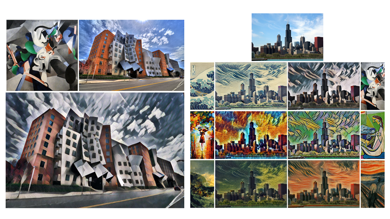

# 手机自拍秒变世界名画—神经风格迁移

[TOC]


# 课程概述

人工智能不仅可以成为最好的司机，最好的医生，最好的工人，还可以成为最棒的艺术家。

借助卷积神经网络这一“神器”，人工智能不仅可以“看得懂”图像，还可以将一张图像的画风迁移到另一张图上。

梵高的“星空”、日本的浮世绘、毕加索的抽象派、莫奈的印象派、达利的超现实主义，都可以成为你手机相册中图片的画风。

我们将详细讲解神经网络风格迁移的酷炫案例、基本原理、技术演进，最后进行代码实战。


# 神经风格迁移简介


# 一键生成—Deepart.io

https://deepart.io


# Fast Style Transfer

Github链接：https://github.com/lengstrom/fast-style-transfer

Fast Style Transfer in TensorFlow: Video Demo：https://www.youtube.com/watch?v=xVJwwWQlQ1o




## Fast Style Transfer代码实战

如果你的电脑中已经安装了Anaconda或者Miniconda，可直接跳到第三步：换源。

### 第一步：安装Miniconda

https://docs.conda.io/en/latest/miniconda.html

选择适合你操作系统和python环境的Miniconda版本，下载。


点击下载得到的安装文件，开始安装，一开始几个窗口采用默认配置选项。


安装路径选择一个`全英文路径`的`空`目录。


不要勾选这两个框。


不勾选这两项，点击`finish`


### 第二步：打开Anaconda Prompt


### 第三步：换源

在Anaconda Prompt中依次运行以下几条命令（可以直接复制下面的所有代码，粘贴到Anaconda prompt中）：

```bash
conda config --add channels https://mirrors.tuna.tsinghua.edu.cn/anaconda/pkgs/free/

conda config --add channels https://mirrors.tuna.tsinghua.edu.cn/anaconda/cloud/conda-forge

conda config --add channels https://mirrors.tuna.tsinghua.edu.cn/anaconda/cloud/msys2/

conda config --set show_channel_urls yes

pip config set global.index-url https://pypi.tuna.tsinghua.edu.cn/simple

```

这些代码的作用是将conda和pip这两个Python的包管理器的源从国外源换到清华大学开源软件镜像站，直接从清华源下载，下载速度就能飞起了。


> 查看源：`conda info`
>
> 切换回默认的源：`conda config --remove-key channels`

### 第四步：搭建虚拟环境

在Anaconda Prompt中依次运行以下命令：

```bash
conda create -n style-transfer python=3.5

activate style-transfer

pip install tensorflow==0.12.1 moviepy

conda install scipy pillow
```

第一行命令：创建一个新的基于Python3.5的环境。创建过程中需要输入`y`和`回车`确认安装。


第二行命令：进入该虚拟环境，你应该会在提示符窗口的开头看到环境名称。


第三行命令：安装Tensorflow的0.12.1版本和moviepy。

第四行命令：安装科学计算库scipy，图像处理库Pillow。安装过程中需要输入`y`和`回车`确认安装。


这两个库也依赖于其它底层库，会自动安装。


> 对于对于 OS X 和 Linux，你需要安装 TensorFlow 0.11.0、Python 2.7.9、Pillow 3.4.2、scipy 0.18.1 和 numpy 1.11.2
> 在终端中输入以下命令
>
> ```
> conda create -n style-transfer python=2.7.9
> 
> source activate style-transfer
> 
> pip install tensorflow==0.12.1
> 
> conda install scipy pillow
> ```

### 第五步：运行图像的神经风格迁移

下载Github中[fast-style-transfer](https://github.com/lengstrom/fast-style-transfer)的项目文件，或者直接下载网盘文件。


确保此时在虚拟环境`style-transfer`中。

如果在`base`环境，运行`activate style-transfer`命令切换到`style-transfer`虚拟环境。

用`cd`命令切换到代码仓库所在的目录。

```
cd D:\fast-style-transfer\fast-style-transfer-master
```


按照下面的格式输入命令，运行图像风格迁移。

```bash
python evaluate.py --checkpoint 预训练模型文件路径 --in-path  输入内容图像路径 --out-path 输出图像保存路径
```

例如，对`shanghai.jpeg`图像用六种风格进行迁移：

```python
python evaluate.py --checkpoint ../checkpoints/rain_princess.ckpt --in-path ../input_img/shanghai.jpeg --out-path ../output_img/shanghai_output.jpg

python evaluate.py --checkpoint ../checkpoints/la_muse.ckpt --in-path ../input_img/shanghai.jpeg --out-path ../output_img/shanghai_output_la_muse.jpg

python evaluate.py --checkpoint ../checkpoints/scream.ckpt --in-path ../input_img/shanghai.jpeg --out-path ../output_img/shanghai_output_scream.jpg

python evaluate.py --checkpoint ../checkpoints/udnie.ckpt --in-path ../input_img/shanghai.jpeg --out-path ../output_img/shanghai_output_udnie.jpg

python evaluate.py --checkpoint ../checkpoints/wave.ckpt --in-path ../input_img/shanghai.jpeg --out-path ../output_img/shanghai_output_wave.jpg

python evaluate.py --checkpoint ../checkpoints/wreck.ckpt --in-path ../input_img/shanghai.jpeg --out-path ../output_img/shanghai_output_wreck.jpg
```

这行命令表示运行当前目录下的evaluate.py文件，使用rain-princess.ckpt预训练模型，对shanghai.jpeg这张图像进行神经风格迁移，输出结果保存为shanghai_output.jpg中。

我们也可以调用其它名画的预训练模型，对不同的图像进行神经风格迁移。

```
python evaluate.py --checkpoint ../checkpoints/wave.ckpt --in-path ../input_img/beijing.jpeg --out-path ../output_img/beijing_output.jpg

python evaluate.py --checkpoint ../checkpoints/rain_princess.ckpt --in-path ../input_img/chicago.jpg --out-path ../output_img/chicago_output.jpg
```


Checkpoint 预训练模型按照以下画作进行了训练：

- Rain Princesss [checkpoint](https://s3.cn-north-1.amazonaws.com.cn/static-documents/nd101/rain-princess.ckpt)，作者：[Leonid Afremov](https://afremov.com/Leonid-Afremov-bio.html)
- La Muse [checkpoint](https://s3.cn-north-1.amazonaws.com.cn/static-documents/nd101/la-muse.ckpt)，作者：[Pablo Picasso（毕加索）](https://en.wikipedia.org/wiki/Pablo_Picasso)
- Udnie [checkpoint](https://s3.cn-north-1.amazonaws.com.cn/static-documents/nd101/udnie.ckpt)，作者：[Francis Picabia](https://en.wikipedia.org/wiki/Francis_Picabia)
- Scream（呐喊） [checkpoint](https://s3.cn-north-1.amazonaws.com.cn/static-documents/nd101/scream.ckpt)，作者：[Edvard Munch](https://en.wikipedia.org/wiki/Edvard_Munch)
- The Great Wave off Kanagawa（日本浮世绘神奈川冲浪里） [checkpoint](https://s3.cn-north-1.amazonaws.com.cn/static-documents/nd101/wave.ckpt)，作者：[Hokusai](https://en.wikipedia.org/wiki/Hokusai)
- The Shipwreck of the Minotaur（运输船遇难） [checkpoint](https://s3.cn-north-1.amazonaws.com.cn/static-documents/nd101/wreck.ckpt)，作者：[J.M.W. Turner](https://en.wikipedia.org/wiki/J._M._W._Turner)

### 第六步：运行视频的神经风格迁移

```bash
python transform_video.py --in-path ../input_img/fox.mp4 --checkpoint ../checkpoints/wave.ckpt --out-path ../output_img/fox_output.mp4 --device /gpu:0 --batch-size 4
```

如果只用cpu的话，要运行很长时间。
