## Fast Style Transfer in [TensorFlow](https://github.com/tensorflow/tensorflow)

Add styles from famous paintings to any photo in a fraction of a second! [You can even style videos!](#video-stylization)

<p align = 'center'>


<a href = 'examples/results/stata_udnie.jpg'>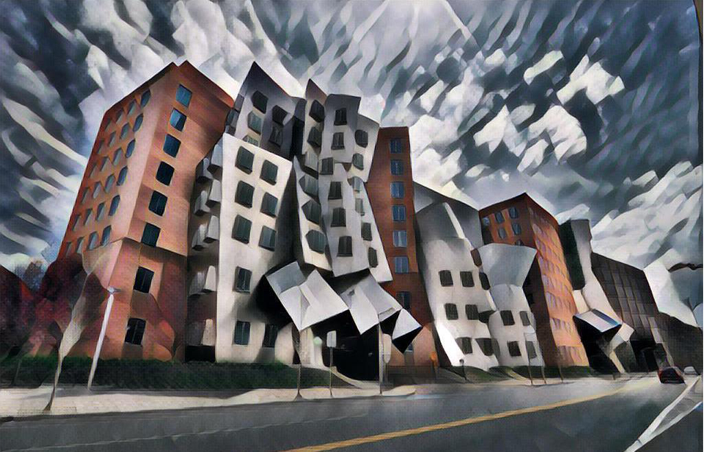</a>
</p>
<p align = 'center'>
It takes 100ms on a 2015 Titan X to style the MIT Stata Center (1024×680) like Udnie, by Francis Picabia.
</p>

Our implementation is based off of a combination of Gatys' [A Neural Algorithm of Artistic Style](https://arxiv.org/abs/1508.06576), Johnson's [Perceptual Losses for Real-Time Style Transfer and Super-Resolution](http://cs.stanford.edu/people/jcjohns/eccv16/), and Ulyanov's [Instance Normalization](https://arxiv.org/abs/1607.08022). 

### License
Copyright (c) 2016 Logan Engstrom. Contact me for commercial use (or rather any use that is not academic research) (email: engstrom at my university's domain dot edu). Free for research use, as long as proper attribution is given and this copyright notice is retained.

## Video Stylization 
Here we transformed every frame in a video, then combined the results. [Click to go to the full demo on YouTube!](https://www.youtube.com/watch?v=xVJwwWQlQ1o) The style here is Udnie, as above.
<div align = 'center'>
     <a href = 'https://www.youtube.com/watch?v=xVJwwWQlQ1o'>
        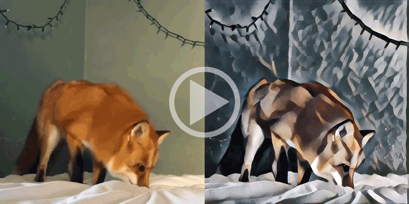
     </a>
</div>

See how to generate these videos [here](#stylizing-video)!

## Image Stylization
We added styles from various paintings to a photo of Chicago. Click on thumbnails to see full applied style images.
<div align='center'>
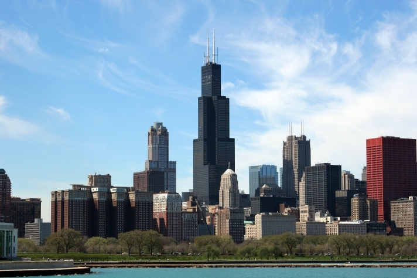
</div>
     
<div align = 'center'>
<a href = 'examples/style/wave.jpg'></a>
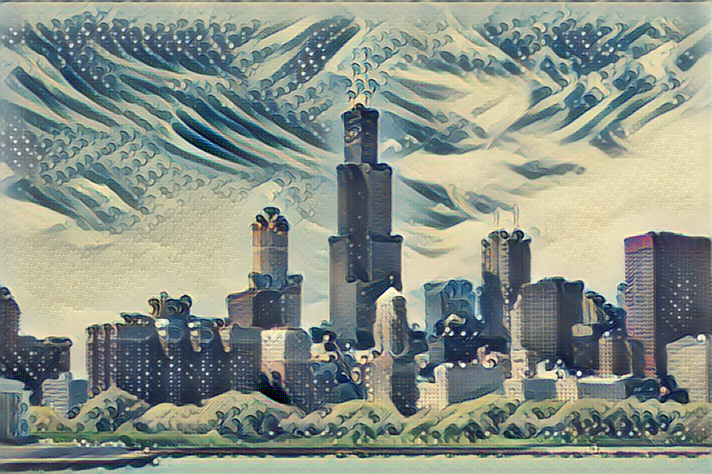
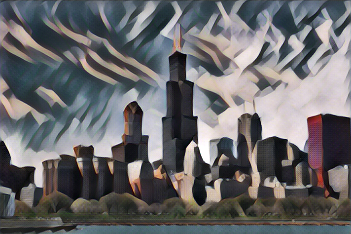
<a href = 'examples/style/udnie.jpg'>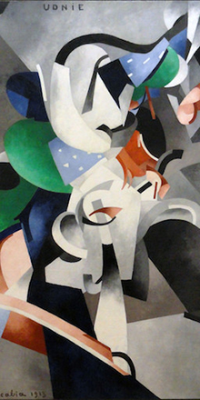</a>
<br>
<a href = 'examples/style/rain_princess.jpg'>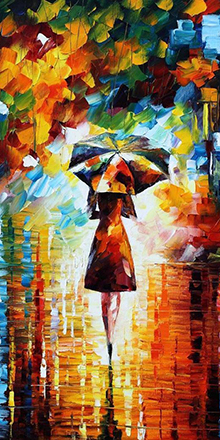</a>
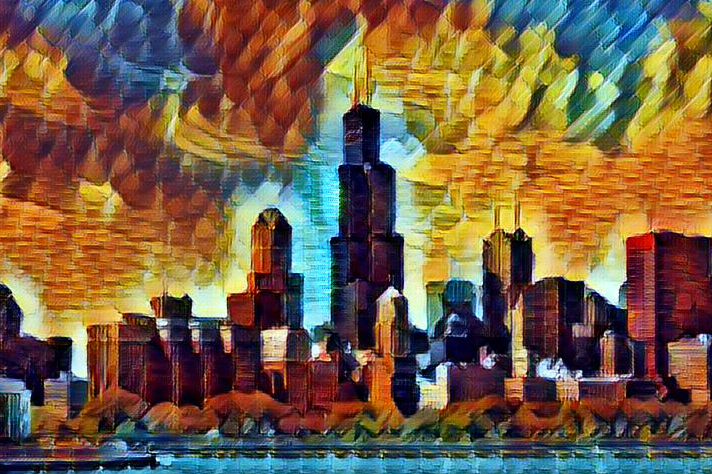
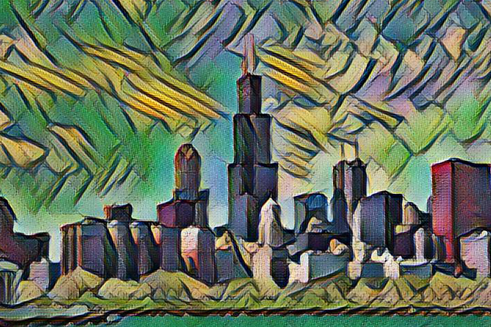
<a href = 'examples/style/la_muse.jpg'>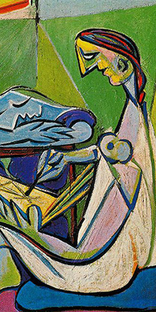</a>

<br>
<a href = 'examples/style/the_shipwreck_of_the_minotaur.jpg'>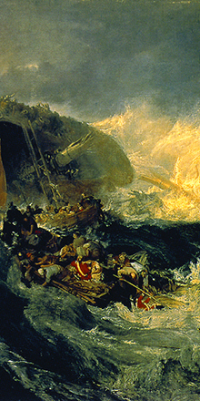</a>

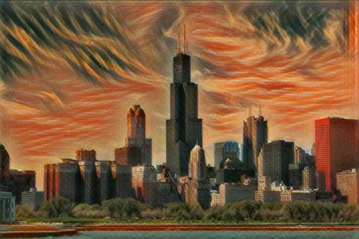
<a href = 'examples/style/the_scream.jpg'>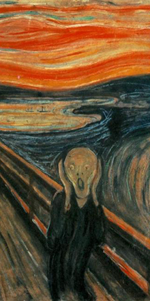</a>
</div>

## Implementation Details
Our implementation uses TensorFlow to train a fast style transfer network. We use roughly the same transformation network as described in Johnson, except that batch normalization is replaced with Ulyanov's instance normalization, and the scaling/offset of the output `tanh` layer is slightly different. We use a loss function close to the one described in Gatys, using VGG19 instead of VGG16 and typically using "shallower" layers than in Johnson's implementation (e.g. we use `relu1_1` rather than `relu1_2`). Empirically, this results in larger scale style features in transformations.

## Documentation
### Training Style Transfer Networks
Use `style.py` to train a new style transfer network. Run `python style.py` to view all the possible parameters. Training takes 4-6 hours on a Maxwell Titan X. [More detailed documentation here](docs.md#stylepy). **Before you run this, you should run `setup.sh`**. Example usage:

    python style.py --style path/to/style/img.jpg \
      --checkpoint-dir checkpoint/path \
      --test path/to/test/img.jpg \
      --test-dir path/to/test/dir \
      --content-weight 1.5e1 \
      --checkpoint-iterations 1000 \
      --batch-size 20

### Evaluating Style Transfer Networks
Use `evaluate.py` to evaluate a style transfer network. Run `python evaluate.py` to view all the possible parameters. Evaluation takes 100 ms per frame (when batch size is 1) on a Maxwell Titan X. [More detailed documentation here](docs.md#evaluatepy). Takes several seconds per frame on a CPU. **Models for evaluation are [located here](https://drive.google.com/drive/folders/0B9jhaT37ydSyRk9UX0wwX3BpMzQ?usp=sharing)**. Example usage:

    python evaluate.py --checkpoint path/to/style/model.ckpt \
      --in-path dir/of/test/imgs/ \
      --out-path dir/for/results/

### Stylizing Video
Use `transform_video.py` to transfer style into a video. Run `python transform_video.py` to view all the possible parameters. Requires `ffmpeg`. [More detailed documentation here](docs.md#transform_videopy). Example usage:

    python transform_video.py --in-path path/to/input/vid.mp4 \
      --checkpoint path/to/style/model.ckpt \
      --out-path out/video.mp4 \
      --device /gpu:0 \
      --batch-size 4

### Requirements
You will need the following to run the above:
- TensorFlow 0.11.0
- Python 2.7.9, Pillow 3.4.2, scipy 0.18.1, numpy 1.11.2
- If you want to train (and don't want to wait for 4 months):
  - A decent GPU
  - All the required NVIDIA software to run TF on a GPU (cuda, etc)
- ffmpeg 3.1.3 if you want to stylize video

### Citation
```
  @misc{engstrom2016faststyletransfer,
    author = {Logan Engstrom},
    title = {Fast Style Transfer},
    year = {2016},
    howpublished = {\url{https://github.com/lengstrom/fast-style-transfer/}},
    note = {commit xxxxxxx}
  }
```

### Attributions/Thanks
- This project could not have happened without the advice (and GPU access) given by [Anish Athalye](http://www.anishathalye.com/). 
  - The project also borrowed some code from Anish's [Neural Style](https://github.com/anishathalye/neural-style/)
- Some readme/docs formatting was borrowed from Justin Johnson's [Fast Neural Style](https://github.com/jcjohnson/fast-neural-style)
- The image of the Stata Center at the very beginning of the README was taken by [Juan Paulo](https://juanpaulo.me/)

### Related Work
- Michael Ramos ported this network [to use CoreML on iOS](https://medium.com/@rambossa/diy-prisma-fast-style-transfer-app-with-coreml-and-tensorflow-817c3b90dacd)
